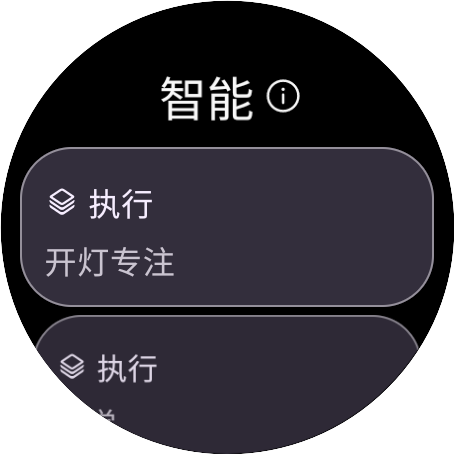
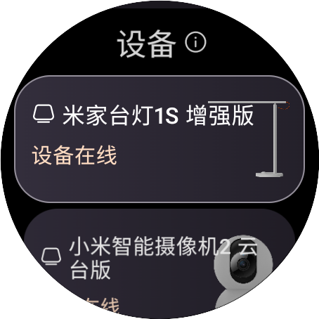
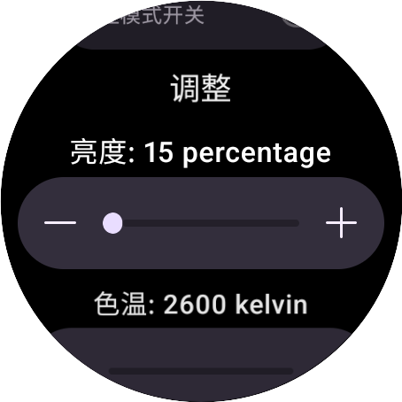
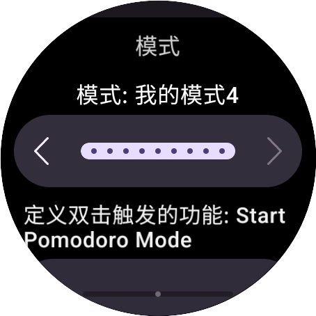
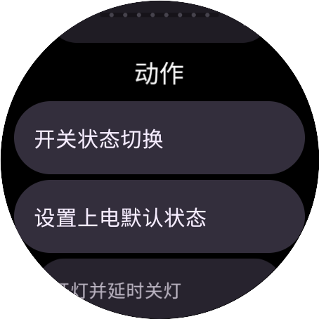

# MiGa 米咖

MiGa (米咖) 是基于米家 API 开发的第三方应用，为手表开发，旨在手表实现米家 APP 的功能。

## 截图

## 功能

-   ✅ 浏览设备列表
-   ✅ 浏览智能场景列表
-   ✅ 收藏智能场景
-   ✅ 通过手动触发智能场景
-   ✅ 通过功能块(卡片)触发智能场景
-   ✅ 通过复杂功能(表盘)触发智能场景
-   ✅ 设备控制

## 第二阶段 TODO

-   [x] 使用 Material Design 3 Expressive 更新应用
-   [ ] 优化部分显示文本没有本地化的问题
-   [ ] 优化运行场景的结果提示信息
-   [ ] 优化运行动作的结果提示信息
-   [ ] 修复切换场景时显示和实际可能不是预期的问题
-   [ ] 给组件添加更多图标
-   [ ] 优化设备的只读信息的 UI 呈现
-   [ ] 适配只读动作的 UI 呈现

如果你在使用中遇到任何问题，请创建 [Issue](https://github.com/AuTsing/MiGa/issues/new)。欢迎提供各种意见和建议。

## 感谢

-   [简池/mijia-api](https://gitee.com/janzlan/mijia-api) 提供 API
-   [Do1e/mijia-api](https://github.com/Do1e/mijia-api) 开发参考
-   [sky130/MiWu](https://github.com/sky130/MiWu) 开发参考

## 声明

该项目仅供学习交流使用，所有公开 API 均来自于网络，使用过程中请遵守相关法律法规。所有隐私内容均会保存在手表本地，软件不会上传关于你的任何内容。如果你不同意此声明，请立即停止使用并删除软件。
