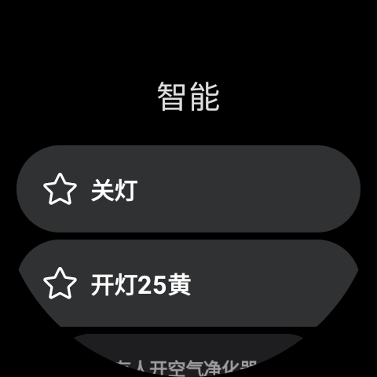
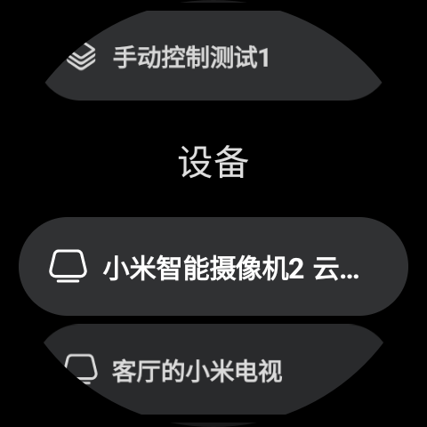

# MiGa 米咖

MiGa (米咖) 是基于米家 API 开发的第三方智能家居应用，为手表开发。

## 截图

 

## 功能

-   ✅ 浏览设备列表
-   ✅ 浏览智能场景
-   ✅ 手动触发智能
-   ✅ 收藏智能场景
-   [ ] 智能设备控制

## 感谢

-   [简池/mijia-api](https://gitee.com/janzlan/mijia-api) 提供 API
-   [Do1e/mijia-api](https://github.com/Do1e/mijia-api) 开发参考
-   [sky130/MiWu](https://github.com/sky130/MiWu) 开发参考

## 声明

该项目仅供学习交流使用，所有公开 API 均来自于网络。使用过程中请遵守相关法律法规。软件不会保存和上传关于你的任何内容。如果你不同意此声明，请立即停止使用并删除软件。
